Unlocking the Potential of Large Language Models for 5G with InstructLab: Enhancing Knowledge and Uptime  

Written by: A. Sonmez in collaboration with S.Molnar

In this demo, we will showcase the enhancement of foundational language models (LLMs) for effectively addressing 5G-related common network faults for CNFs, improving response times by accelerating remediation efforts to minimize downtime.

To get started, you can leverage the demo.redhat.com platform or deploy your own private InstructLab instance for this demonstration. We shall use a (fully open sourced) model for the LLM as published by IBM.

For more information about instructLab <https://www.redhat.com/en/topics/ai/what-is-instructlab>

# Addressing Knowledge Gaps with LLMs

Commonly available large language models (here we used Merlinite or Granite) are powerful tools for processing natural language queries for general topics. However, these were not trained with telco network practices nor environment specific internal knowledge and training a new model from scratch is computationally expensive and time consuming.

One approach is to use Retrieval augmented generation (RAG) to provide additional specific content from a vector database to enrich the responsiveness of the models. RAG will improve the context but may have scalability issues and relevance constraints.

 

While telecommunications companies (telcos) may rely on LLMs sourced from external parties for industry specific use, its very restrictive due to the inability to use internal domain knowledge base content and while some tuning may be possible it would be limiting to tune to reflect the latest network information. Training such models would be extremely time consuming and resource hungry even if done internally, and coming by the large amount of generated training data is hard and potentially expensive.

To address the problems at hand, another hybrid approach is suggested where the use of RAG is providing frequently changing content while the LLMs used are enhanced with specific skills. This approach ensures:

- faster availability since no re-training is needed since only skilling up of the widely available foundational model is done,

- improved scalability by performing the skillset related synthesis of data for training, 

- speed and latency since the model retains its original form with specific skill extensions.

Lastly, different models can be skilled for specific tasks, further ensuring applicability, since different smaller and streamlined models can be used for very specific tasks instead of one-for-all potentially over bloated model. 

In this demo we shall provide the approach for deploying an open source 5G core functionality on an OpenShift platform and enhance the chosen foundational model with specific skills to aid in troubleshooting the 5G operational issues. 

We used lab-enhanced Merlinite models released by IBM (derived from mistral).

Note: _in later releases InstructLab will have more model options based on Granite models_ .

## What is InstructLab

    InstructLab is a fully open-source project from Red Hat, and the MIT-IBM Watson AI Lab, that introduces Large-scale Alignment for chatBots (LAB). The project's innovation helps during the instruction-tuning phase of LLM training. However, to fully understand the benefit of this project, you need to be familiar with some basic concepts of what an LLM is and the difficulty and cost associated with training a model.

# Deploy the demo workload

The chosen independent open source tool is the Open5Gs CNF providing the demo workload. However you can skip this part, error messages will be enough to proceed for this demo. To deploy Open5Gs, here are different deployment methodologies on Red Hat OpenShift Platform, operator based deployment will be easier: 

\[a] <https://medium.com/@anil.sonmez/open5gs-on-openshift-container-platform-c92e72dd4738>

\[b] <https://medium.com/@anil.sonmez/kubernetes-operators-for-cnf-deployment-22f4b6ef4fe2>

\[c] <https://medium.com/@anil.sonmez/5g-slicing-with-gitops-17a9f2db5e81>

## Demo use case - mandatory component missing

When deploying Open5Gs some mandatory configurations are needed from the platform side, such as the presence of Stream Control Transmission Protocol (SCTP) on your platform. 

If you fail to enable SCTP, AMF will (5G core network function) will error out by failing the application resulting in a crash loop back of the pod (as a cloud native recovery response for application failures). 

AMF CNF erring out: 

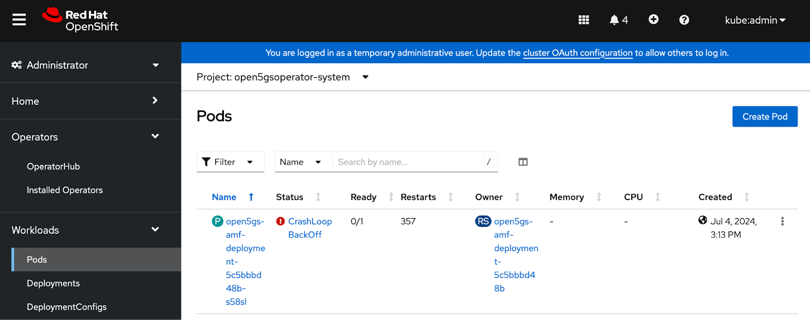

By looking into the cause of the problem the following log entries are seen:

    Open5GS daemon v2.2.2

    [32m07/17 12:03:41.321[0m: [[33mapp[0m] [1;32mINFO[0m: Configuration: '/open5gs/config-map/amf.yaml' (../lib/app/ogs-init.c:129)
    [32m07/17 12:03:41.321[0m: [[33mapp[0m] [1;32mINFO[0m: File Logging: '/var/log/open5gs/amf.log' (../lib/app/ogs-init.c:132)
    [32m07/17 12:03:41.330[0m: [[33mapp[0m] [1;32mINFO[0m: AMF initialize...done (../src/amf/app.c:33)
    [32m07/17 12:03:41.332[0m: [[33msbi[0m] [1;32mINFO[0m: nghttp2_server() [0.0.0.0]:80 (../lib/sbi/nghttp2-server.c:144)
    [32m07/17 12:03:41.333[0m: [[33msock[0m] [1;33mERROR[0m: socket create(2:1:132) failed (93:Protocol not supported) (../lib/core/ogs-socket.c:87)
    [32m07/17 12:03:41.333[0m: [[33msock[0m] [1;31mFATAL[0m: ogs_sctp_socket: Assertion `new' failed. (../lib/sctp/ogs-lksctp.c:57)
    [32m07/17 12:03:41.334[0m: [[33mcore[0m] [1;31mFATAL[0m: backtrace() returned 11 addresses (../lib/core/ogs-abort.c:37)
    /lib/x86_64-linux-gnu/libogssctp.so.2(ogs_sctp_socket+0x125) [0x7f239e5dc45c]
    /lib/x86_64-linux-gnu/libogssctp.so.2(ogs_sctp_server+0x122) [0x7f239e5dc810]
    open5gs-amfd(+0x168b8) [0x55aafa5a98b8]
    open5gs-amfd(+0x488b8) [0x55aafa5db8b8]
    open5gs-amfd(+0x1e304) [0x55aafa5b1304]
    /lib/x86_64-linux-gnu/libogscore.so.2(ogs_fsm_init+0x9e) [0x7f239e60401c]
    open5gs-amfd(+0x7961) [0x55aafa59a961]
    /lib/x86_64-linux-gnu/libogscore.so.2(+0x142be) [0x7f239e5f72be]
    /lib/x86_64-linux-gnu/libpthread.so.0(+0x9609) [0x7f239dec2609]
    /lib/x86_64-linux-gnu/libc.so.6(clone+0x43) [0x7f239dde9293]

Surely something can be done with the error message to troubleshoot. What if I had a capability to ask a system for suggestions to the problem at hand.

# Preparation for enhancing a ready made LLM with skills

We shall check the ready LLM for recommendations based on the error messages from above to establish a baseline.

Later we shall prepare a set of questions and answers defining our new skill to enhance the previous LLM and re-check the responses.

This enhancement process will consume a fraction of time and resources than training an LLM from scratch, and provides a flexible means to add additional skills and updates as required over time.  Since the skills are defined independent of the LLM, hence can be applied to any other LLM of choice later by repeating the process.  And finally, the resulting enhanced LLM maintains the original format and can be used in coordination of other tools, such as RAGs and agents later in the pipeline.

In this demo we shall provide a summary of the InstructLab train process, for details refer to the InstructLab [git page](https://github.com/instructlab/instructlab).  

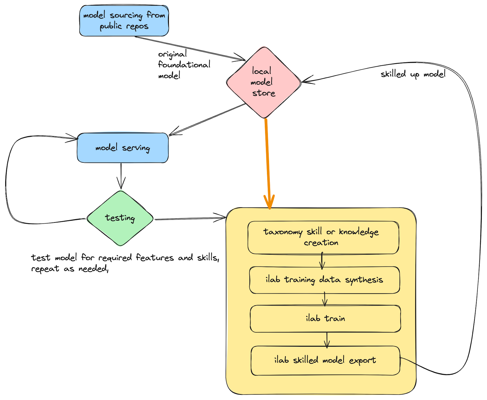

Figure depicting InstructLab training process for foundational models

## Step 1 - set up lab environment

Begin by ordering an InstructLab RHEL VM from [RHDemo](https://demo.redhat.com). This VM is specifically designed for running LLMs on a GPU accelerated environment. We will not focus on providing guidance on creating your own GPU enabled environment to run InstructLab for now, but can be easily achieved. 

Note: that this has been tested on InstructLab 0.17.1 with Nvidia A10 and older Nvidia Tesla P40 GPUs.

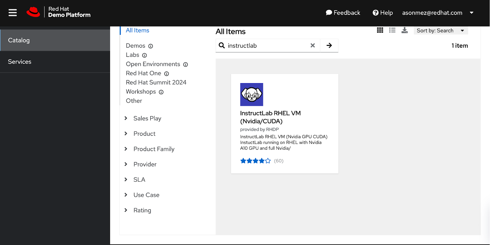

You can reach the demo environment with the email provided url after successful provisioning or on Service view on demo.redhat.com:

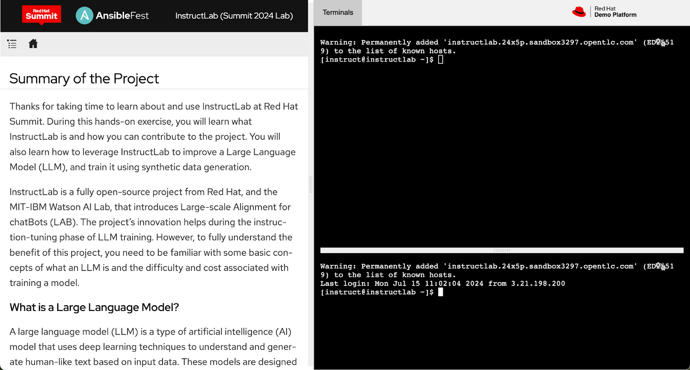

## Step 2 - serve and chat

Let's check what is the general response from a ready LLM before tuning.

InstructLab provides a convenient environment for interacting with the model server and other functions via python virtual environments.

Serve the model by running the following commands  (**_ilab serve_**):

    # Navigate to instructlab root folder and activate the python virtual env
    [instruct@instructlab ~]$ cd instructlab

    [instruct@instructlab instructlab]$ source venv/bin/activate
    (venv) [instruct@instructlab instructlab]$ 

    (venv) [instruct@instructlab instructlab]$ ilab model serve --model-path  models/merlinite-7b-lab-Q4_K_M.gguf 
    INFO 2024-07-15 11:06:55,421 serve.py:51: serve Using model 'models/merlinite-7b-lab-Q4_K_M.gguf' with -1 gpu-layers and 4096 max context size.
    INFO 2024-07-15 11:07:13,426 server.py:218: server Starting server process, press CTRL+C to shutdown server...
    INFO 2024-07-15 11:07:13,426 server.py:219: server After application startup complete see http://127.0.0.1:8000/docs for API.

Since the model serving is a blocking function, start another terminal window to interact with the chat function   (**_ilab chat_**): 

Note: _if multiple models are served, you can select which one you want to chat with using the -m option._

    [instruct@instructlab ~]$ cd instructlab

    [instruct@instructlab instructlab]$ source venv/bin/activate

    (venv) [instruct@instructlab instructlab]$ ilab model chat -m models/merlinite-7b-lab-Q4_K_M.gguf 

Via the chat feature let’s ask about the error message we are getting. 

    I am getting error on open5Gs as 5G deployed on Red Hat OpenShift Platform, logs showing sock FATAL ogs_sctp_socket Assertion new failed. lib/sctp/ogs-lksctp.c 
    Can you help me to understand and solve this problem ?

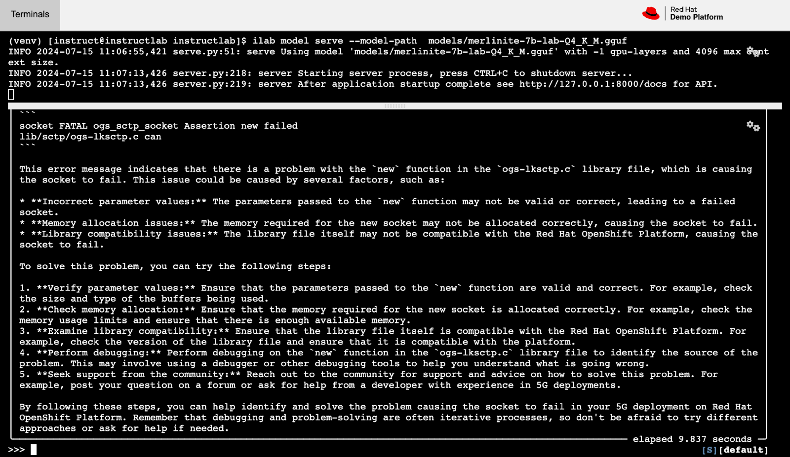

As you may have guessed the response is too generic, borderline irrelevant. This is due to the fact that the model used has only general knowledge of things, but was not trained on anything on Open5Gs nor SCTP protocol handling. 

## Step 3 - create a specific skillset into the taxonomy

Now let's improve the model 

InstructLab leverages a taxonomy structure to provide content for our LLM enhancement, in this demo about Open5Gs and some troubleshooting content. We have provided the relevant content [file](https://github.com/ansonmez/open5gilab) that will need to be presented in the right folder structure for InstructLab to correctly process.

The taxonomy structure is organized into folders for foundational skills like reasoning, compositional skills and different knowledge topics like technical manuals or STEM topics. 

For more details please refer to the InstructLab [documentations](https://github.com/instructlab/taxonomy/blob/main/README.md).

The following commands will create the required folders within the InstructLab provided stub structure and will also download the prepared skill for Open5Gs for the demonstration.

    (venv) [instruct@instructlab instructlab]$ mkdir -p taxonomy/knowledge/open5gs/overview

    (venv) [instruct@instructlab instructlab]$ curl -o taxonomy/knowledge/open5gs/overview/qna.yaml https://raw.githubusercontent.com/ansonmez/open5gilab/main/qna2.yaml 

 

The knowledge taxonomy that we are providing here consist mainly of questions and answers that instructLab will use to train and embed the skill on. 

Here is a glimpse into the file downloaded:

    (venv) [instruct@instructlab instructlab]$ cat taxonomy/knowledge/open5gs/overview/qna.yaml   

    created_by: anilsonmez
    domain: open5gs
    seed_examples:
    - answer: Apply a machineconfig configuration with a file containing the sctp module load command.
      question: What could be the solution for FATAL ogs_sctp_socket Assertion new failed ogs-lksctp.c on OpenShift?
    - answer: A machineconfig configuration is used to define the settings and parameters that apply to a specific node or group of nodes in an OpenShift cluster. In this case, you will configure the sctp module to be loaded during the boot process of the nodes where Open5GS is deployed.\n4. Verify that SCTP is enabled and functioning correctly by checking for any FATAL ogs\\_sctp\\_socket Assertion new failed /lib/sctp/ogs-lksctp.c errors in the OpenShift logs. If you encounter such an error, it may indicate that SCTP is not properly configured or that there are missing dependencies.\n\nBy following these steps, you can ensure that SCTP is correctly enabled for Open5GS on Red Hat OpenShift, preventing potential communication issues between components and facilitating seamless operation of the 5G Core and EPC network
      question: What could be the solution for FATAL ogs_sctp_socket Assertion new failed ogs-lksctp.c on OpenShift?
    - answer: Open5GS can be deployed on OpenShift via Operators, Helm chart, or GitOps approach. The GitOps approach involves managing OpenShift resources using declarative configurations stored in a Git repository. This approach ensures that the environment is consistently configured and version-controlled. To enable SCTP using a GitOps approach, follow these steps Clone the open5gs GitOps repository git clone https://github.com/ansonmez/ocpopen5gs . Navigate to the load-sctp-module directory and apply the necessary changes by executing oc apply f load-sctp-module.yaml. Verify that the SCTP module is loaded on OpenShift by checking the logs of the open5gs pod. If necessary, load the sctp module on the machines kernel by executing modprobe sctp
      question: What could be the solution for FATAL ogs_sctp_socket Assertion new failed ogs-lksctp.c on OpenShift?
    - answer: check if the sctp module is loaded on the machines kernel, create a new machine config or update an existing one with the required settings, and apply the machine config using oc apply -f <machineconfig>.yaml. Additionally, note that enabling sctp on OpenShift requires machineconfig configuration
      question: What could be the solution for FATAL ogs_sctp_socket Assertion new failed ogs-lksctp.c on OpenShift?
    - answer: By ensuring that SCTP is enabled correctly, you can avoid issues like FATAL ogs sctp socket Assertion new failed /lib/sctp/ogs-lksctp.c, which may arise due to improper configuration or missing dependencies.
      question: What could be the solution for FATAL ogs_sctp_socket Assertion new failed ogs-lksctp.c on OpenShift?
    - answer: To deploy Open5GS successfully on Red Hat OpenShift, the SCTP protocol should be enabled at the CoreOS level. This requirement is essential because Open5GS depends on SCTP for seamless communication between various components of the 5G Core and EPC. Enabling SCTP on OpenShift requires machineconfig configuration, which ensures that the sctp module is loaded correctly during Open5GS deployment. Specifically, you can enable SCTP by following the instructions provided in the load-sctp-module.yaml script
      question: What could be the solution for FATAL ogs_sctp_socket Assertion new failed ogs-lksctp.c on OpenShift?
    - answer: To enable SCTP on Red Hat OpenShift for Open5GS, you can follow the instructions provided in the load-sctp-module.yaml script. However, note that enabling sctp requires machineconfig configuration, as mentioned earlier. This ensures that the sctp module is loaded correctly during Open5GS deployment.
      question: What could be the solution for FATAL ogs_sctp_socket Assertion new failed ogs-lksctp.c on OpenShift?
    - answer: Install Open5GS Operator or deploy it via Helm chart or GitOps approach.\n2. Enable the sctp protocol on CoreOS level by following the instructions in <https://github.com/ansonmez/ocpopen5gs/blob/main/load-sctp-module.yaml>.\n3. Create a machineconfig configuration for enabling SCTP on OpenShift.
      question: What could be the solution for FATAL ogs_sctp_socket Assertion new failed ogs-lksctp.c on OpenShift?
    - answer: Check if the sctp module is loaded on the machine's kernel by executing lsmod | grep sctp
      question: What could be the solution for FATAL ogs_sctp_socket Assertion new failed ogs-lksctp.c on OpenShift?
    - answer: To ensure proper sctp enablement, you need to create a machineconfig configuration file (e.g., using the sample from <https://github.com/ansonmez/ocpopen5gs/blob/main/load-sctp-module.yaml>). This will update the necessary OpenShift configurations for sctp.Afterward, check the sctp module's status by executing oc get machineset -o yaml | grep -A2 sctp and ensure that it shows a ready status. This step verifies that sctp is correctly enabled in your Open5GS deployment on Red Hat OpenShift Platform for 5G. If you encounter any issues, review the Open5GS documentation or contact Red Hat Support for assistance.
      question: What could be the solution for FATAL ogs_sctp_socket Assertion new failed ogs-lksctp.c on OpenShift?
    - answer: To deploy Open5GS on OpenShift with sctp protocol, you need to enable sctp at the CoreOS level. This can be achieved by using a machineconfig configuration. An example of a script that enables sctp on OpenShift is provided here https://github.com/ansonmez/ocpopen5gs/blob/main/load-sctp-module.yaml. Ensure that the script and all necessary steps are followed correctly to enable sctp successfully
      question: What could be the solution for FATAL ogs_sctp_socket Assertion new failed ogs-lksctp.c on OpenShift?
    - answer: It is important to ensure that the sctp implementation is properly configured and optimized for the specific use case to avoid potential issues with resource utilization or network latency.
      question: What could be the solution for FATAL ogs_sctp_socket Assertion new failed ogs-lksctp.c on OpenShift?
    - answer: Apply a machineconfig configuration with a file containing the sctp module load command.
      question: What could be the solution for FATAL ogs_sctp_socket Assertion new failed ogs-lksctp.c on OpenShift?
    - answer: open5gs requires sctp protocol to operate please check sctp protocol enabled properly on OpenShift
      question: What could be the solution for FATAL ogs_sctp_socket Assertion new failed ogs-lksctp.c on OpenShift?
    - answer: Disabling sctp on OpenShift can lead to the failure of open5GS due to the dependency of open5GS on sctp for operation. This can result in the termination or instability of the core network for LTE/NR networks (Release-17)
      question: What could be the solution for FATAL ogs_sctp_socket Assertion new failed ogs-lksctp.c on OpenShift?
    - answer: open5gs requires sctp protocol to operate please check sctp protocol enabled properly on OpenShift
      question: What could be the solution for FATAL ogs_sctp_socket Assertion new failed ogs-lksctp.c on OpenShift?
    - answer: Verify that the required system libraries (e.g., libsctp) are properly installed and configured on your OpenShift cluster. Ensure that they meet the dependencies specified in the official Open5GS documentation.      
      question: What could be the solution for FATAL ogs_sctp_socket Assertion new failed ogs-lksctp.c on OpenShift?
    - answer: open5gs requires sctp protocol, machineconfig or machine config required to enable sctp protocol on OpenShift 
        please check sctp protocol enabled properly on OpenShift
      question: What could be the solution for FATAL ogs_sctp_socket Assertion new failed ogs-lksctp.c on OpenShift?
    - answer: open5gs 5g cNFs requires sctp protocol to communicate between different cNFs and pods running properly that communication hapenning
        please check sctp protocol enabled properly on Red Hat OpenShift Platform
      question: What could be the solution for FATAL ogs_sctp_socket Assertion new failed /lib/sctp/ogs-lksctp.c on OCP?
    - answer: open5gs 5g cNFs requires sctp protocol to communicate between different nodes
        please check sctp protocol enabled properly on Red Hat OpenShift Platform for open5gs
      question: What could be the solution for FATAL ogs_sctp_socket Assertion new failed ../lib/sctp/ogs-lksctp.c Open5GS deployed on Red Hat OpenShift Platform?
    - answer: open5gs 5g cNFs requires sctp protocol to communicate between different nodes
        please check sctp protocol enabled it is up to date on Red Hat OpenShift Platform for open5gs
      question: What could be the solution for FATAL ogs_sctp_socket Assertion new failed /lib/sctp/ogs-lksctp.c Open5G deployed on Red Hat OpenShift Platform?
    - answer: open5gs 5g cNFs especially AMF requires sctp protocol to communicate with eNodeB
        please check sctp protocol enabled properly on Red Hat OpenShift Platform for open5gs which you can enable with machine config 
      question: What could be the solution for FATAL ogs_sctp_socket Assertion new failed /lib/sctp/ogs-lksctp.c:57 open5GS deployed on Red Hat OpenShift Platform?
    task_description: 'Details of sctp protocol requirements on Red Hat OpenShift Platform for 5G, cNF open5gs'
    document:
      repo: https://github.com/ansonmez/open5gilab
      commit: 14c3f1a
      patterns:
        - README.md

## Step 4 - generate

To be relatively capable you will need to synthesize the data for the skill which in turn will generate variations of the questions and answers provided. A good start is to have around 500 training sets. This instruction synthesis will take time, will consume disk space as it creates the data and will use your GPU capabilities, and  this is still just the preparation for the training.

We start off by serving an LLM for the natural language processing of the instructions. In another terminal window we will initiate the generation process.

    (venv) [instruct@instructlab instructlab]$ ilab model serve --model-path  models/merlinite-7b-lab-Q4_K_M.gguf 

In the other terminal window, start generating instructions:

    (venv) [instruct@instructlab instructlab]$ ilab data generate --num-instructions 500 --model  models/merlinite-7b-lab-Q4_K_M.gguf 

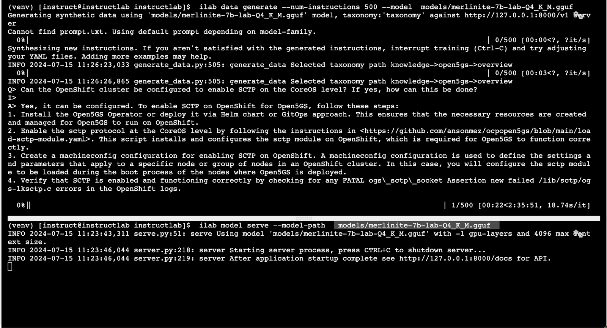

Once the generation completes you can check the data created::

    (venv) [instruct@instructlab instructlab]$ ls -lrt generated/

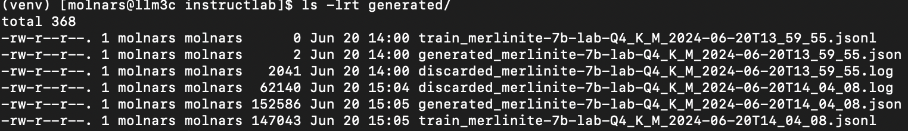

## Step 5 - train

Now that synthesized training data for our specific topical skill is ready we need to do the final merging of the skill into the model. This is the instructLab train function (**ilab train**):

Here the input model is merlinite and the output model is ggml-model-f16 which is tuned with synthetic data that we generated before. 

Note: ilab model train outputs a brand-new model that can be served in the models directory called **_ggml-model-f16.gguf_**

    (venv) [instruct@instructlab instructlab]$ ilab model train --device cuda 

Again, we will observe that some time is needed to perform the train function and the GPUs will be used. The resulting model file will be ready to be served once the process finishes.

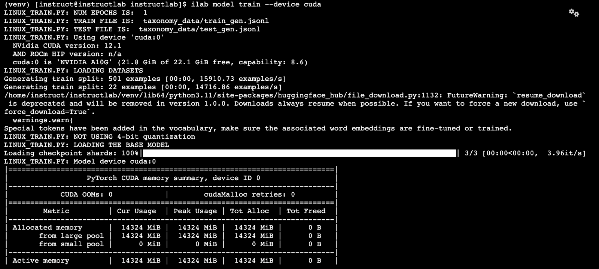

## Step 6 - serve and chat

The new enhanced model is ready to be served: (**ilab serve** with reference to newly created model):

    (venv) [instruct@instructlab instructlab]$ ilab model serve --model-path   models/ggml-model-f16.gguf 

In another window start chat (**ilab chat**):

    (venv) [instruct@instructlab instructlab]$ ilab model chat -m models/ggml-model-f16.gguf 

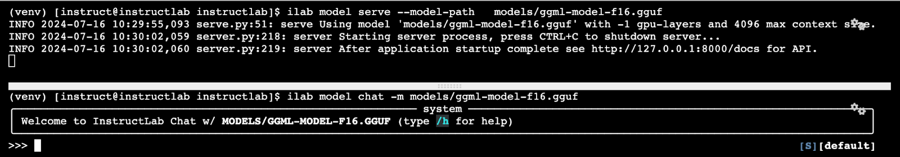

And ready to ask the same exact question to observe the difference in response compared to step #2:

     I am getting error on open5G as 5G deployed on Red Hat OpenShift Platform, logs showing sock FATAL ogs_sctp_socket Assertion new failed. lib/sctp/ogs-lksctp.c can you help me to understand and solve this problem ?

Since the skillset had references also, it will be presented along with the improved, more specific response based on the training:

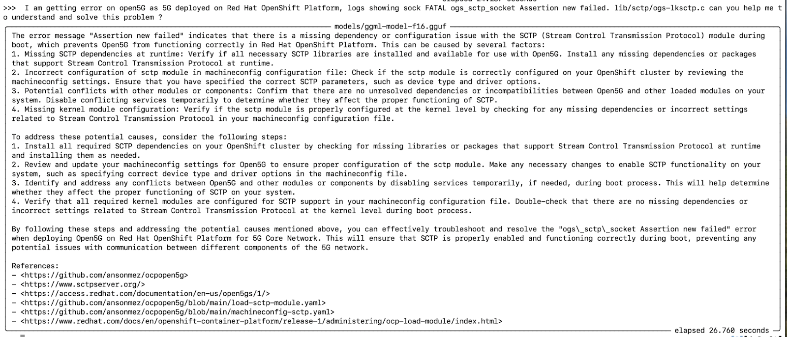

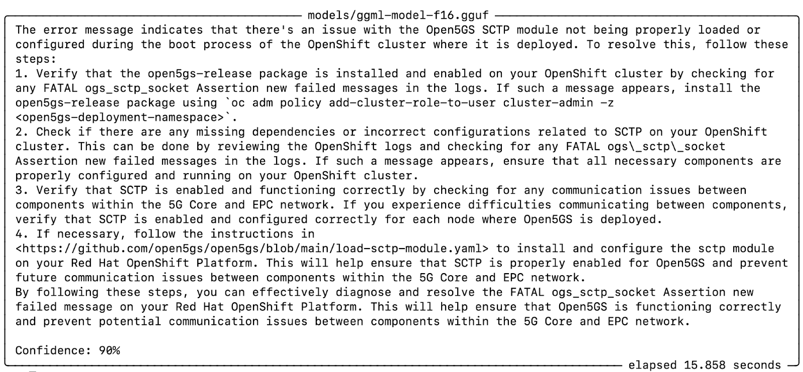

\----------------

# Troubleshooting issues

Unfortunately you may get errors during installation because of numpy and llama\_cpp\_python version incompatibilities referenced in InstructLab,

## Appendix - llama\_cpp\_python 0.2.79 

This is tested for instructlab 0.17.1 version 

The error we are facing :

AttributeError: \`np.float\_\` was removed in the NumPy 2.0 release. Use \`np.float64\` instead.. Did you mean: 'float16'?

    pip install  llama_cpp_python==0.2.79 -C cmake.args="-DLLAMA_CUBLAS=on"

    vi ./venv/lib/python3.11/site-packages/instructlab-0.17.1.dist-info/METADATA

    Change 
    Requires-Dist: llama-cpp-python[server] ==0.2.75
    to
    Requires-Dist: llama-cpp-python[server] >=0.2.75

    pip install instructlab -C cmake.args="-DLLAMA_CUDA=on"

    (venv) [instruct@instructlab instructlab]$ ilab model train --device cuda 
